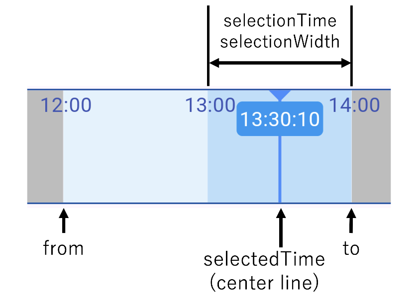

<!--
This README describes the package. If you publish this package to pub.dev,
this README's contents appear on the landing page for your package.

For information about how to write a good package README, see the guide for
[writing package pages](https://dart.dev/guides/libraries/writing-package-pages).

For general information about developing packages, see the Dart guide for
[creating packages](https://dart.dev/guides/libraries/create-library-packages)
and the Flutter guide for
[developing packages and plugins](https://flutter.dev/developing-packages).
-->

Time Seek Slider widget to display and select date and time.

## Features



- Set available term (fixedTerm, from, to)
- Set width of section (sectionWidth)
- Select time of section (sectionTime: 10s, 30s, 1m, 10m, 1h, 3h, 12h, 24h)
- Select color of primary and secondary section
- Select color of time text
- Show current time over center line
- Add event layer overlay with height / color / period
- Drag or Tap to change selected DateTime
- Receive event changed time
- Receive event dragging time

## Getting started

Add `time_seek_slider: ^0.0.7` to your `pubspec.yaml` dependencies. And import it:
```
import 'package:time_seek_slider/time_seek_slider.dart';
```

## Usage

Simply create a `TimeSeekSlider` widget, and pass the required params.   
Add longer examples to `/example` folder.
```dart
DateTime _selectedTime = DateTime(2024,4,28,15,30);

TimeSeekSlider(
  selectedTime: _selectedTime,
  onChangedSelectedTime: (time) {
    setState(() {
      _selectedTime = time;
    });
  },
),
```

If use fixed term, set `fixedTerm = true`.
```dart
DateTime _from = DateTime(2024,4,28,0,0);
DateTime _to = DateTime(2024,4,29,0,0);
DateTime _selectedTime = DateTime(2024,4,28,15,30);

TimeSeekSlider(
  fixedTerm: true
  from: _from,
  to: _to,
  selectedTime: _selectedTime,
  onChangedSelectedTime: (time) {
    setState(() {
      _selectedTime = time;
    });
  },
),
```


## Params

| Param | M/O | Type |  |
|--|--|--|--|
| selectedTime | M | DateTime | Selected time |
| fixedTerm | O | bool | Set if available term fixed |
| from | O | DateTime | Start time of fixed term |
| to | O | DateTime | End time of fixed term |
| sectionTime | O | int | Time of one section |
| sectionWidth | O | int | Width (px) of one section |
| timeTextColor | O | Color | Color of time text |
| sectionColorPrimery | O | Color | Color of primery section |
| sectionColorSecondary | O | Color | Color of secondary section |
| centerLineColor | O | Color | Color of center line (current time line) |
| showCurrentTime | O | ShowCurrentTime | Show current time over center line |
| currentTimeTextColor | O | Color | Color of current time text |
| currentTimeTextBackgroundColor | O | Color | Background color of current time text |
| events | O | List< TimeEvent >? | Event information displayed overlay the slider |


| event | M/O |  |
|--|--|--|
| onChangedSelectedTime  | M | Fired when tap the bar or end of dragging. |
| onChangingSelectedTime | O | Fired when dragging the bar. |

